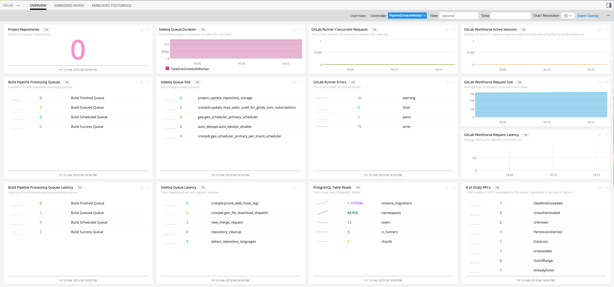
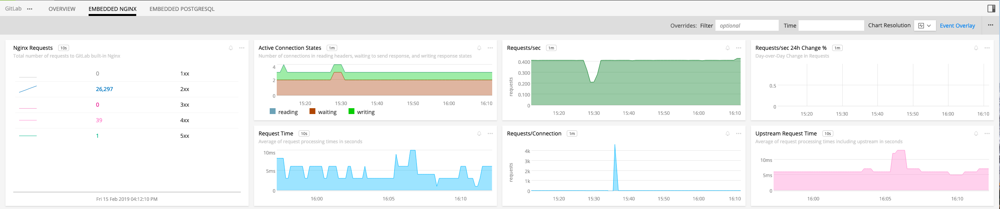
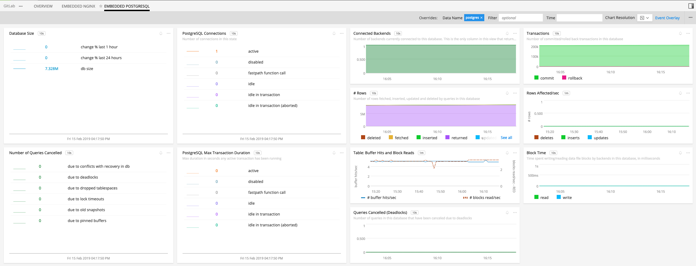

# 

- [Description](#description)
- [Requirements and Dependencies](#requirements-and-dependencies)
- [Installation](#installation)
- [Configuration](#configuration)
- [Usage](#usage)
- [Metrics](#metrics)
- [License](#license)

### DESCRIPTION

GitLab is an open-source web-based git repository manager developed by GitLab Inc. GitLab has built-in features for creating wiki pages, issue-tracking and CI/CD pipelines. GitLab is bundled with <a target="_blank" href="https://docs.gitlab.com/ee/administration/monitoring/prometheus/index.html">Prometheus exporters</a> that can be configured to export performance metrics of itself and that of the bundled software that GitLab depends on. These exporters publish Prometheus metrics at endpoints which can be scraped by the <a target="_blank" href="https://github.com/signalfx/signalfx-agent/blob/master/docs/monitors/prometheus-exporter.md">prometheus-exporter</a> monitor of the <a target="_blank" href="https://github.com/signalfx/integrations/tree/master/signalfx-agent">SignalFx Smart Agent</a>.

### REQUIREMENTS AND DEPENDENCIES

| Software | Version |
|----------|---------|
| GitLab   | 9.3+    |

### INSTALLATION

Install the latest version of the SignalFx Smart Agent for your environment as described [here](https://github.com/signalfx/signalfx-agent#installation).

### CONFIGURATION
#### GitLab Configuration

Follow the instructions <a target="_blank" href="https://docs.gitlab.com/ee/administration/monitoring/prometheus/index.html">here</a> to configure the GitLab's Prometheus exporters to expose metric endpoint targets. For GitLab Runner monitoring configuration go <a target="_blank" href="https://docs.gitlab.com/runner/monitoring/README.html">here</a>. Below is a list of some of the Prometheus endpoint targets. Note that target gitlab_monitor metrics are just targets gitlab_monitor_database, gitlab_monitor_process and gitlab_monitor_sidekiq metrics combined.

| Target                  | Default Port | Path       |
|-------------------------|--------------|------------|
| gitaly                  | 9236         | /metrics   |
| gitlab-sidekiq          | 8082         | /metrics   |
| gitlab-unicorn          | 8080         | /-/metrics |
| gitlab-workhorse        | 9229         | /metrics   |
| gitlab_monitor_database | 9168         | /database  |
| gitlab_monitor_process  | 9168         | /process   |
| gitlab_monitor_sidekiq  | 9168         | /sidekiq   |
| gitlab_monitor          | 9168         | /metrics   |
| nginx                   | 8060         | /metrics   |
| node                    | 9100         | /metrics   |
| postgres                | 9187         | /metrics   |
| prometheus              | 9090         | /metrics   |
| redis                   | 9121         | /metrics   |
| gitlab-runner           | 9252         | /metrics   |

#### Smart Agent Configuration

Find and edit the SignalFx Smart Agent configuration file `agent.yaml` to configure <a target="_blank" href="https://github.com/signalfx/signalfx-agent/blob/master/docs/monitors/prometheus-exporter.md">prometheus-exporter</a> monitors for the Prometheus endpoint targets. For example, you can define a prometheus-exporter monitor per endpoint target as shown below. Though verbose, it is the only way to configure metricPath, extraDimension, metricsToExclude etc per endpoint target. 
```yaml
...
monitors:
  - type: prometheus-exporter
    discoveryRule: port == 9236
    metricPath: /metrics
    metricsToExclude:
      - go_gc_duration_seconds
      - go_goroutines
      - go_info
    extraDimensions:
      metric_source: gitlab-gitaly
  - type: prometheus-exporter
    discoveryRule: port == 8082
    metricPath: /metrics
    metricsToExclude:
      - ruby_file_descriptors
    extraDimensions:
      metric_source: gitlab-sidekiq
  - type: prometheus-exporter
    discoveryRule: port == 8080
    metricPath: /-/metrics
    extraDimensions:
      metric_source: gitlab-unicorn
...
```
Optionally if the configuration is shared among the prometheus-exporter monitors then the configuration can be written compactly as shown below.

```yaml
...
monitors:
  - type: prometheus-exporter
    discoveryRule: port == 9236 || port == 8082 || port == 9229 || port == 9168 || port == 8060 || port == 9100 || port == 9187 || port == 9090  || port == 9121
    metricPath: /metrics 
    extraDimensions:
      metric_source: gitlab
...
```

### USAGE

Sample of built-in dashboard in SignalFx:







#### Important conditions to watch out for

You may need configure Nginx to allow network access to the SignalFx Smart Agent. For example, in a docker setup where the agent and the GitLab containers are in network 172.17.0.0/16 add the `allow 172.17.0.0/16;` line in the `/var/opt/gitlab/nginx/conf/nginx-status.conf` file.
```
server {
    ...
    location /metrics {
    ...
    allow 172.17.0.0/16;
    deny all;
    }
}
```
### METRICS

For documentation of the metrics and dimensions emitted: [gitaly](./docs/gitaly), [monitor](./docs/monitor), [nginx](./docs/nginx), [node](./docs/node), [postgres](./docs/postgres), [prometheus](./docs/prometheus), [redis](./docs/redis), [sidekiq](./docs/sidekiq), [unicorn](./docs/unicorn), [workhorse](./docs/workhorse).

### LICENSE

This integration is released under the Apache 2.0 license. See [LICENSE](./LICENSE) for more details.